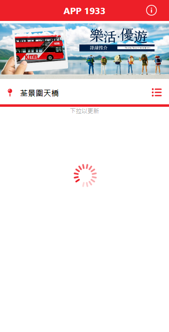

# Getting started

#### Click to visit: https://startling-kitten-6d3073.netlify.app/
<br/>

### Introduction 

This is a web application that mimics the KMB app, you can check the ETA and watch the route of buses near 荃景圍天橋 and 荃灣柴灣角街. For better user experience, you can pulldown to get the latest data or choose specific stop that you want by clicking the dropdown button. 
<br/>
<br/>

### Screenshots:

You can choose the bus stop by clicking the dropdown button:
<br/>
<br/>
&nbsp;&nbsp;&nbsp;&nbsp;&nbsp;&nbsp;&nbsp;&nbsp;
<br/>
<br/>
<br/>

The detail page shows the bus details and ETA respectively.
<br/>

You can also toggle the button to show the bus route manually:
<br/>
<br/>
&nbsp;&nbsp;&nbsp;&nbsp;&nbsp;&nbsp;&nbsp;&nbsp;
<br/>
<br/>

If there is any problem please do not hesitate to contact me:
<br/>
<br/>
&nbsp;&nbsp;&nbsp;&nbsp;&nbsp;&nbsp;&nbsp;&nbsp;
<br/>

<br/>

# Installation

#### Create an API key in the google developers console: https://console.developers.google.com
Set up a new project and generate an API key. (You can also edit the map style by map ID)
<br />
<br />

#### Open a .env file in the project root and specify your API key as:

```
REACT_APP_GOOGLE_MAPS_API_KEY=your_api_key_here
```
<br/>

#### In the directory, you need to install the packages by running:

```
$ yarn install
```
OR

```
$ npm install
```
<br/>

#### After installed the packages run:

```
$ yarn start
```
OR

```
$ npm start
```
<br/>

#### Then visit:

```
http://localhost:3000
```

<br/>

#### Visit directly:

```
https://startling-kitten-6d3073.netlify.app/
```

<br/>
<br/>

# Assumption

### Data source:
https://data.gov.hk/tc-data/dataset/hk-td-tis_21-etakmb
<br/>

### Bus stops:
For simplicity, the bus stops are base on two locations (荃景圍天橋 and 荃灣柴灣角街).
<br/>
The bus stop ID are :
<br/>
荃景圍天橋: "BFA3460955AC820C"
<br/>
荃灣柴灣角街: "5FB1FCAF80F3D97D"
<br/>
<br/>

# Choice of solutions

### @react-google-maps/api:  
Import Google Map
<br/>
<br/>
User friendly, popular and comprehensive. The package is frequently maintained. 
<br/>

### react-simple-pull-to-refresh:  
Pull down to refresh  
<br/>
Simulate the mobile gesture, increase user experience while refresh.
<br/>

### react-loading-icons:
To add loading icon  
<br/>
Can import the loading icon directly with animation.
<br/>

### @fortawesome/react-fontawesome:
To add some useful icons  
<br/>
It provides numerous of icons, reduce the time of development. 
<br/>

### react-router-dom:
Navigate between pages  
<br/>
Friendly to use, popular among developers and the package is frequently maintained.
<br/>

### moment:
Format the time for ETA
<br/>
<br/>
Popular package to handle date and time, clean code and useful.
<br/>