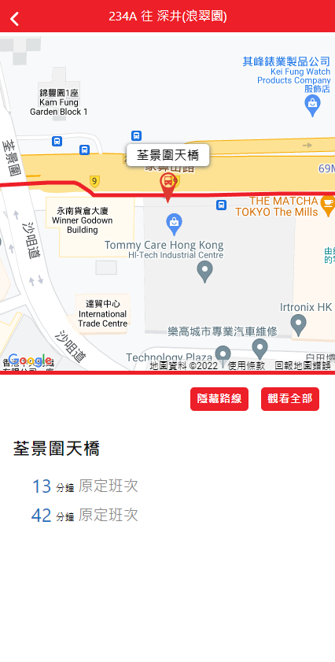

# Getting started

Click to visit: 


&nbsp;&nbsp;&nbsp;&nbsp;&nbsp;&nbsp;&nbsp;&nbsp;

&nbsp;&nbsp;&nbsp;&nbsp;&nbsp;&nbsp;&nbsp;&nbsp;

&nbsp;&nbsp;&nbsp;&nbsp;&nbsp;&nbsp;&nbsp;&nbsp;

# Installing 

Create an API in the google developers console https://console.developers.google.com, make sure to enable billing for the google project, otherwise you may get a warning as development purposes only.  
<br />
Open a .env file in the project root and specify your API key as  
```
REACT_APP_GOOGLE_MAPS_API_KEY=your_api_key_here
```

In the project directory, you can run:

```
$ yarn install
$ yarn start
```
OR using npm

```
$ npm install
$ npm start
```

Then, 
```
visit http://localhost:3000
```
<br/>

# Assumtion

### Bus listing Part:  
Bus stop with identical name can have different bus stop ID. For simplicity, bus listing results are based on the Bus stop ID "BFA3460955AC820C" & "5FB1FCAF80F3D97D".  

### Bus detail Part:
Maximum allowed waypoints is 25, so I systematically select 25 bus stops, including the bus stop (in red color) that you have clicked in, to display on the map.
As not all waypoints are chosen, the route shown on the map may be a little bit different from the exact route.
<br/>
<br/>

# Choice of solutions

### @react-google-maps/api:  
To import google map   
Reasons: easy to use, popular among developers, and package is frequently maintained
<br/>

### react-simple-pull-to-refresh:  
To add the function of pulling down to refresh  
Reasons: easy to use, package is frequently maintained, and package size is small
<br/>

### react-loading-icons:
To change the loading icon  
Reasons: easy to use and package is frequently maintained
<br/>

### react-icons:
To add some useful icons (like left arrow which indicates back to previous page)  
Reasons: easy to use, popular among developers, and package is frequently maintained
<br/>

### react-router-dom:
To navigate between pages  
Reasons: easy to use, popular among developers, package is frequently maintained, and package size is small