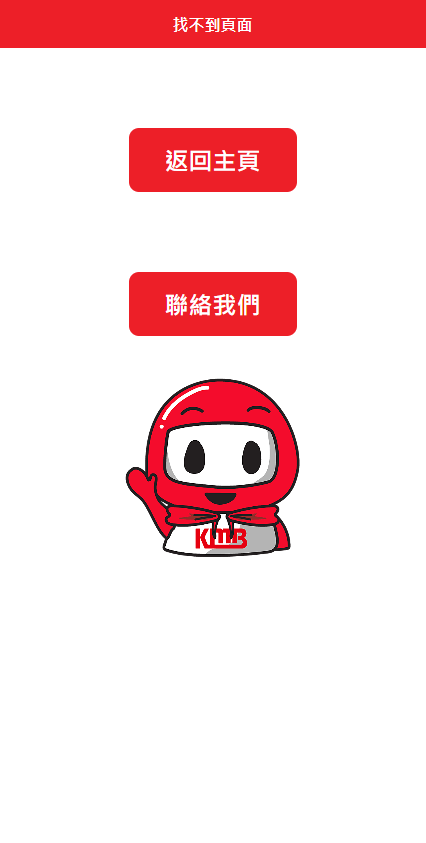

# Getting started

#### Click to visit: 

<br/>

### Screenshots:
You can choose the bus stop by clicking the dropdown button:
(default 荃景圍天橋 and 荃灣柴灣角街)
&nbsp;&nbsp;&nbsp;&nbsp;&nbsp;&nbsp;&nbsp;&nbsp;
<br/>
The detail page shows the bus detail and ETA respectively, you can also toggle to show the bus route manually:
&nbsp;&nbsp;&nbsp;&nbsp;&nbsp;&nbsp;&nbsp;&nbsp;
<br/>
If there is any problem please do not hesitate to contact me:
&nbsp;&nbsp;&nbsp;&nbsp;&nbsp;&nbsp;&nbsp;&nbsp;

<br/>
# Installation

Create an API in the google developers console: https://console.developers.google.com
<br/>
Set up a new project and generate an API key. (You can also edit the map style by map ID)
<br />
Open a .env file in the project root and specify your API key as  

```
REACT_APP_GOOGLE_MAPS_API_KEY=your_api_key_here
```

In the directory, you need to install the packages by running:

```
$ yarn install
```
OR

```
$ npm install
```
<br/>
After installed the packages run:
```
$ yarn start
```
OR

```
$ npm start
```
<br/>
Then visit:
```
http://localhost:3000
```

<br/>
<br/>

# Libraries

### @react-google-maps/api:  
Import Google Map
<br/>

### react-simple-pull-to-refresh:  
Pull down to refresh  
<br/>

### react-loading-icons:
To add loading icon  
<br/>

### @fortawesome/react-fontawesome:
To add some useful icons  
<br/>

### react-router-dom:
Navigate between pages  
<br/>

### moment:
Format the time for ETA